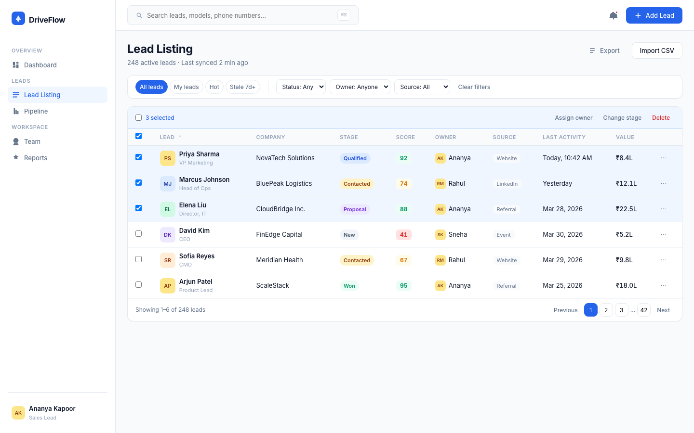
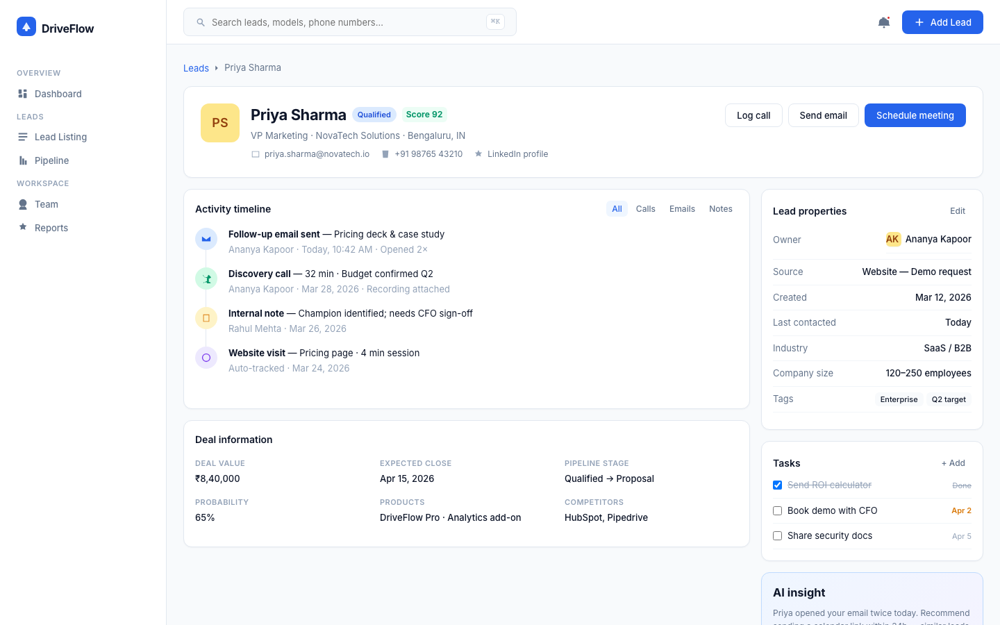
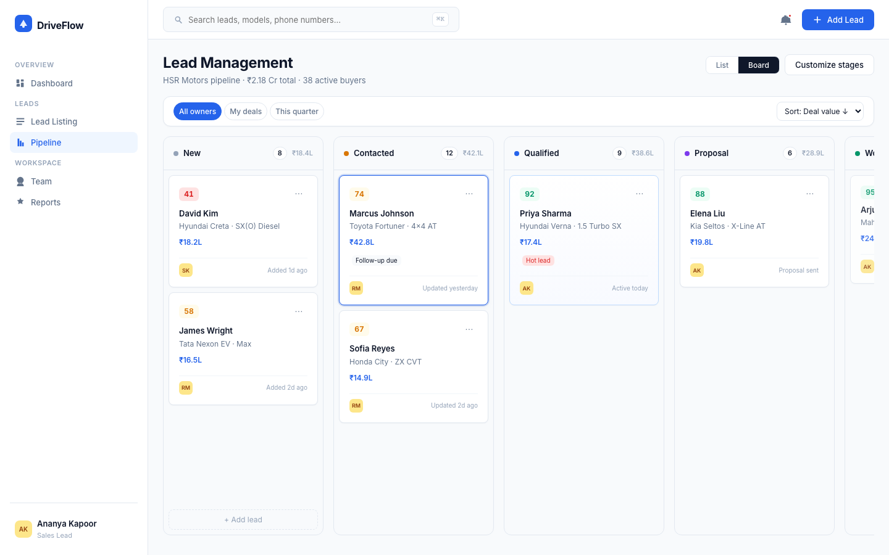
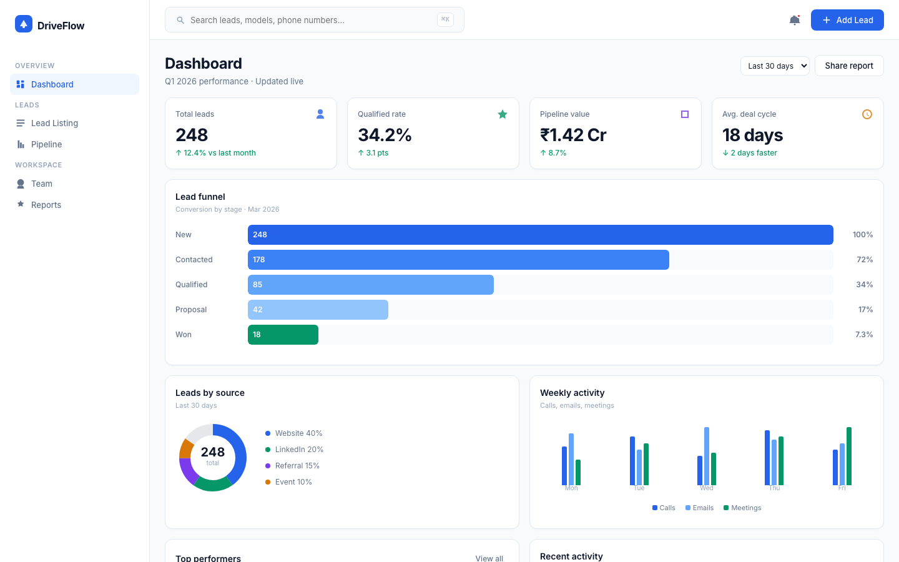

# 1. Executive Summary

**Product Name:** DriveFlow  
**Client:** HSR Motors (Car Dealership)  
**Platform:** Desktop Web Application (1440px)  
**Designer:** Deepak Gouda | RVCE | deepakigouda.scs23@rvce.edu.in

HSR Motors receives leads from Facebook, Google, their website, and offline events—but tracks everything in spreadsheets with no real-time collaboration. **DriveFlow** is a centralized lead management CRM that replaces manual tracking with a modern, collaborative workflow for sales reps and business managers.

This document covers the problem analysis, user personas, four core screens, automation features, and design rationale—aligned with the DeltaX assignment template.

---

# 2. Problem Statement

## 2.1 Current Situation

HSR Motors is a car dealership that advertises across Facebook, Twitter, Google, and their website, and also collects leads from offline events. Their goal is to convert interested buyers into showroom visits and vehicle purchases.

Today, the team uses **spreadsheet software** to manually track lead status (New, Contacted, Not Interested, Qualified, etc.). This creates several pain points:

| Pain Point | Business Impact |
|------------|-----------------|
| No real-time updates | Reps call the same lead twice; managers see stale data |
| No ownership clarity | Leads sit unassigned; accountability breaks down |
| No activity history | Context lost when reps hand off or go on leave |
| Manual reporting | Business managers spend hours building weekly reports |
| No prioritization | High-intent buyers buried in long lists |

## 2.2 Product Goal

Design a **one-stop desktop web application** that:

1. Gives the **Sales Team** a fast way to call, qualify, and update leads
2. Gives the **Business Manager** a dashboard to analyze funnel health and team performance
3. Enables **real-time collaboration** across the lead management team
4. Adds **automation** to reduce manual effort and improve conversion

---

# 3. User Personas

## Persona 1 — Sales Executive (Primary User)

**Name:** Ananya Kapoor  
**Role:** Sales Team  
**Goal:** Reach leads by phone, understand car preferences (model, budget, timeline), qualify them, and update status accurately.

**Frustrations:** Spreadsheet is slow on mobile calls; can't see who else touched a lead; forgets follow-ups.

**Needs:** Quick lead list, one-click call logging, pipeline board to drag deals forward, task reminders.

## Persona 2 — Business Manager (Secondary User)

**Name:** Rahul Mehta  
**Role:** Business Manager  
**Goal:** Quick-view dashboard to analyze lead volume, source quality, conversion rates, and rep performance.

**Frustrations:** Manual Excel pivot tables; no visibility into bottlenecks (e.g., leads stuck in "Contacted").

**Needs:** Funnel chart, source breakdown, KPI cards, team leaderboard, export for leadership.

---

# 4. Product Vision — DriveFlow

**Tagline:** *From lead to keys—faster.*

DriveFlow combines the **CRM density of HubSpot**, the **speed and precision of Linear**, and the **relationship-centric detail of Attio**—tailored for HSR Motors' internal sales workflow.

### Design System

| Token | Value | Rationale |
|-------|-------|-----------|
| Frame width | 1440px | Standard desktop CRM viewport |
| Spacing | 8pt grid (8, 16, 24, 32…) | Visual consistency across dense data |
| Font | Inter | Optimized for UI legibility at small sizes |
| Primary color | #2563EB | Trust + action without aggressive CTAs |
| Cards | 12px radius, soft shadow | Modern SaaS depth hierarchy |

### Automation Features (Differentiators)

1. **Lead scoring (0–100)** — Prioritize hot buyers based on engagement, budget signals, and source quality
2. **AI follow-up nudges** — Suggest next action when a lead opens emails or revisits pricing pages
3. **Stale lead alerts** — "Stale 7d+" filter surfaces neglected opportunities
4. **Bulk assign & stage change** — Ops efficiency for high-volume campaigns
5. **Auto activity tracking** — Website visits and email opens logged without manual entry

---

# 5. Screen Designs

## 5.1 Screen 1 — Lead Listing

**Purpose:** High-volume triage—search, sort, filter, and bulk-manage leads.



### Key UX Decisions

- **Table over cards** for 200+ leads—densest scannable format
- **Columns:** Lead (avatar + role), Company, Stage badge, Score, Owner, Source, Last activity, Deal value
- **Two-layer filters:** Quick chips (All · My leads · Hot · Stale 7d+) + dropdowns (Status · Owner · Source)
- **Bulk toolbar** appears on row selection—Assign owner, Change stage, Delete
- **Click lead name** → navigates to Lead Details

**Workflow solved:** Sales rep opens app Monday morning, filters "My leads" + "Hot", calls top-scored leads first.

---

## 5.2 Screen 2 — Lead Details

**Purpose:** Single-lead deep dive—full context before every call.



### Key UX Decisions

- **70/30 layout:** Activity timeline (hero) + properties sidebar (supporting)
- **Hero actions at top:** Log call · Send email · Schedule meeting (primary CTA)
- **Typed timeline:** Email, call, note, web visit—with filter tabs
- **Deal information grid:** Value, expected close, stage, probability, interested models, competitors
- **Tasks widget:** Checkbox follow-ups with due dates
- **AI insight card:** Proactive nudge based on engagement ("Opened email 2×—send calendar link")

**Workflow solved:** Rep prepares for callback in 30 seconds without asking teammates "what happened with this lead?"

---

## 5.3 Screen 3 — Lead Management (Pipeline Kanban)

**Purpose:** Visual pipeline management—move leads through stages, assign owners, schedule follow-ups.



### Key UX Decisions

- **Kanban columns:** New → Contacted → Qualified → Proposal → Won
- **Column headers show count + total ₹ value** — managers assess pipeline health per stage
- **Cards include:** Score, name, company, deal value, tags (Hot / Follow-up due), owner avatar
- **Drag-and-drop affordance** — blue focus ring on active card
- **List/Board toggle** — same data, two mental models
- **"+ Add lead" per column** — reduce friction for stage-specific entry
- **Toolbar filters:** All owners · My deals · This quarter

**Workflow solved:** Sales manager runs standup, scans board for stuck deals in "Contacted", reassigns follow-ups.

> **Note:** This is the primary screening image for the assignment submission form.

---

## 5.4 Screen 4 — Dashboard

**Purpose:** Business manager analytics—funnel health, source ROI, team performance.



### Key UX Decisions

- **4 KPI cards:** Total leads · Qualified rate · Pipeline value · Avg. deal cycle
- **Full-width funnel chart** — conversion drop-off by stage
- **Leads by source donut** — marketing channel mix (Website, Facebook, Google, Events)
- **Weekly activity bars** — calls vs. emails vs. meetings by weekday
- **Top performers table** — rep leaderboard with revenue and conversion %
- **Recent activity feed** — live pulse of wins, email opens, new leads

**Workflow solved:** Business manager exports Monday report in 2 clicks instead of building Excel pivots.

---

# 6. User Flows

```
Lead arrives (Facebook / Website / Event)
        ↓
   Lead Listing → filter & assign owner
        ↓
   Lead Details → log call, add notes, set tasks
        ↓
   Pipeline Kanban → drag to Qualified → Proposal
        ↓
   Dashboard → manager tracks conversion & source ROI
        ↓
   Won → revenue attributed to rep + source
```

**Navigation:** Persistent 240px sidebar (Dashboard · Lead Listing · Pipeline) + ⌘K global search.

---

# 7. Feature Prioritization (MVP vs. Future)

| Priority | Feature | Screen |
|----------|---------|--------|
| P0 | Lead list with filters & sort | Listing |
| P0 | Lead detail with timeline | Details |
| P0 | Kanban pipeline with stage updates | Management |
| P0 | KPI + funnel dashboard | Dashboard |
| P1 | Lead scoring | All |
| P1 | Bulk actions | Listing |
| P2 | AI follow-up suggestions | Details |
| P2 | WhatsApp / SMS integration | Details |
| P3 | Mobile companion app | — |

---

# 8. Future Enhancements

1. **API integrations** — Facebook Lead Ads, Google Ads, website form webhooks
2. **Workflow automation** — Auto-assign by source/region; SLA alerts for uncontacted leads
3. **Showroom scheduling** — Calendar sync for test-drive bookings
4. **Inventory linking** — Match lead interest to available car models
5. **Role-based access** — Manager vs. rep permissions

---

# 9. Prototype & Deliverables

| Deliverable | Location |
|-------------|----------|
| Interactive prototype | `driveflow-design/index.html` (open in browser) |
| Lead Management screenshot | `SUBMISSION-lead-management-screen.png` |
| UX rationale (extended) | `UX-DECISIONS.md` |
| Figma recreation spec | `FIGMA-SPEC.md` |

**How to view:** Open `index.html` in Chrome. Use sidebar or bottom frame switcher to navigate all 4 screens.

---

# 10. Conclusion

DriveFlow transforms HSR Motors' spreadsheet workflow into a collaborative, insight-driven CRM. The four screens map directly to daily jobs:

- **Listing** = triage at scale  
- **Details** = context before every interaction  
- **Kanban** = move deals forward visually  
- **Dashboard** = accountability and analytics  

By combining lead scoring, bulk ops, activity timelines, and AI nudges, DriveFlow reduces manual effort while improving conversion—exactly what HSR Motors needs to scale beyond spreadsheets.

---

*Submitted for DeltaX Product Associate Assignment — July 2026*
